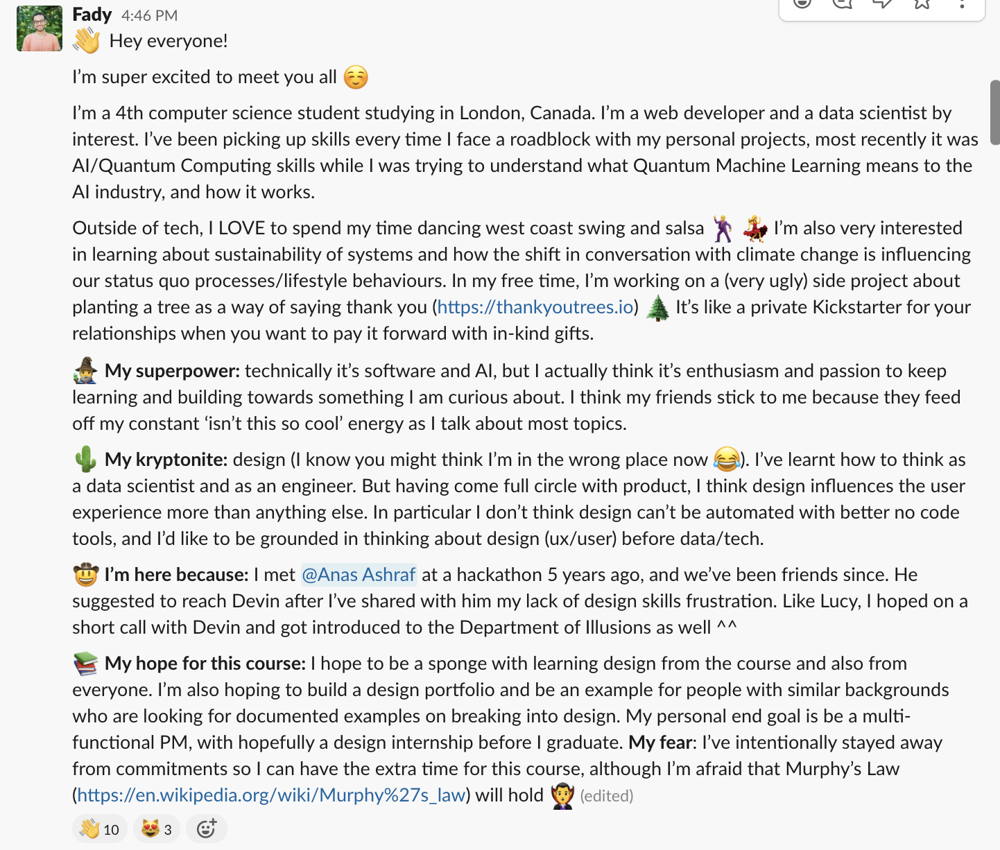

For the next 12 weeks at DOI, I'll be breaking down my journal entries into 3 sections. 
1. How I'm feeling/doing so far. 
2. The assignment for this week, and (hopefully) my assignment work.
3. My discussion takeaways for this week (once a week).

## How I'm feeling so far
Week 1 started slow, which gave us some room to settle down and get our commitments in order for the program. We talked about work ethics that a good team member should have in the course, regardless if they're a designer or not. This put me as ease to know that it's okay if something pops up in life and I can't deliver what I should have.

I've also just come back from speaking at my first panel talk this month at Kitchener (Canada), and I'm starting to review my personal story since I never had to talk (and think) about myself for this long.

## The assignment for this week
The assignment for this week was a couple of self discovery questions that we had to prepare and share with the cohort on Slack before our discussion: 
- Brief introduction 1-3 sentences
- What’s your superpower?
- What’s your kryptonite?
- What hopes and fears do you have about this course?

In hindsight, I should have made my responses perhaps more design specific especially since I knew I was a wild card in the cohort (no formal design experience).

## Discussion takeaways
Our discussions this week focused on community introductions between the cohort members, the coaches and Devin. 

Devin then shared his vision for the program, explaining that there's no right path to design and everyone should feel comfortable with creating their own path through this course. 

> # No one wins until everyone wins

Since DOI will be putting us in groups for the later assignments, and the nature of design is also collaborative (working with multiple stakeholders/designers) Devin spoke about team work for a good solid 5 minutes. 

> # Operate as a guarantee for one another 

We also talked about being a guarantee for each person. As Devin put it first, "I operate as a guarantee for you. This means if I ask for one hour of your time for this meeting, then it's my responsibility to make sure we commit to that". 

In other words, since we commited to the program, it's our responsibility to make sure we either complete our work or let the team know in advance that you won't be able to make the deadline.
<!-- Ask what the purpose of mentioning Victor Papanek book? -->