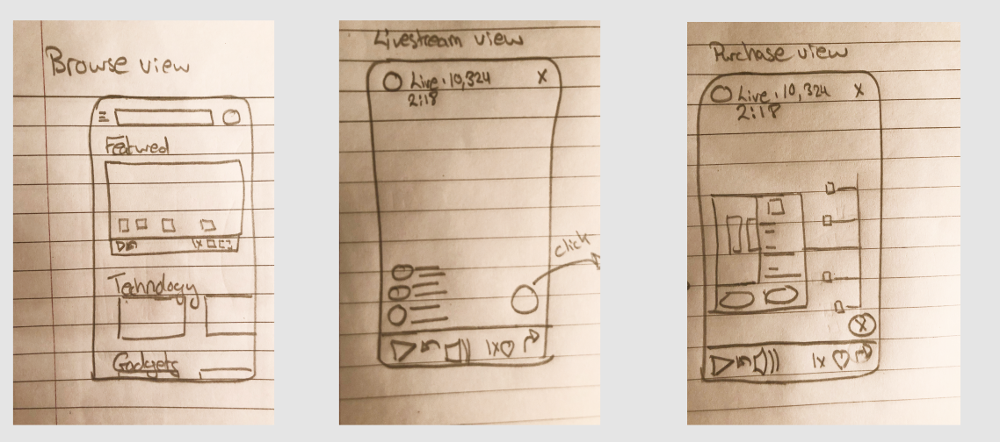
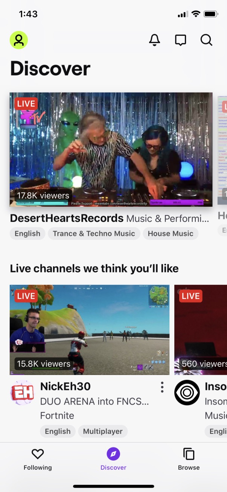
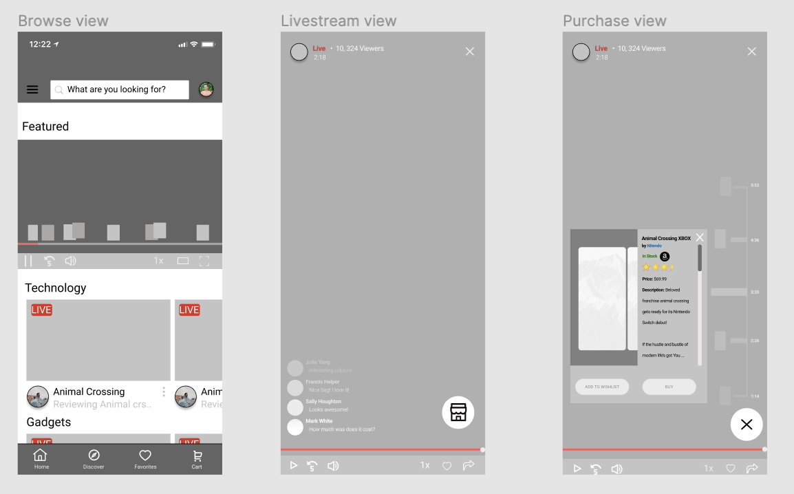

#### Index:

- [How I'm feeling so far](#howAmIfeeling)
- [The assignment for this week](#assignment)
- [My responses](#responses)
- [This week's assignment takeaways](#assignmentTakeaways)
- [This week's discussions takeaways](#discussionTakeaways)

###  How I'm feeling so far

I'm feeling a little stretched thin this week. I've started a summer school course last week, and the pace has picked up significantly lately. I've also started to make sure I go out for an hour's worth of walk every day to make sure I keep healthy at home.

This week's design assignment has also been a bit challenging for me, because I've never done a mid-fi before. The assignment became a lot easier when Devin suggested to screenshot some of the screens that I find relevant and start drawing over them on Figma.

Taken a bit extreme, you can frankenstein components that you found from different places and put them together. Obviously you should take inspiration and change them to fit for your purpose.

This small tip drastically improved my confidence because that was the start I needed to get the ball rolling.

###  The assignment for this week

**Interaction Design**

We'll be wireframing 3 screens (mid-fi) for a live streaming shopping mobile app (think something like Amazon Live, or Taobao Live).
The 3 screens that need to be produced are:

- The live streamer browse view, a grid or list of streamers who are live right now.
- The live stream view, where you watch the live streamer review the items.
- The product detail view where you can review information about a specific product and purchase it.

**Prompt:**

> Noor brings up the Live screen from the main menu and sees a list of all the streamers who are broadcasting right now. She sees that some of her favorite streamers are online and in the middle of a stream now. She taps on a streamer and it launches into the video stream. The streamer is reviewing a new product and Noor can see there is lots of chatter from the audience about this item. Looks like the streamer is presenting 6 hot new items for summer and she’s up to item number 3. Noor can see a highlight of which item is currently being presented right now and taps on it to get more information about this thing. On the product details view Noor continues to listen to the streamer talk about the product while she scans the usual information about the product, images, name, brand, average rating, price, description, amongst other things. Noor thinks this product is pretty cool and adds it to her wishlist, then closes the product details view and goes back to the live stream view.

###  My responses

I wanted to create an experience where the user can engage with products without stopping them from browsing or watching the live shopping videos.

#### Twitch

I check out a couple of live video apps and I liked Twitch the most. This was because I liked the existing visual hierarchy:

- title (streamer name),
- purpose of the video,
- and a system of categorization using tags.

I also found it easy to browse through the Discover page because the layout was compact and simple. This is experience was relative to YouTube and Amazon Live (web app on mobile).

That being said, the titles of the sections and perhaps the 'featured' videos up top could be better highlighted for the purpose of live mobile shopping.

#### Loom

I also liked Loom's video player (for the Browse View). It's pretty easy to see people's reaction to certain moments in your video as you can see in the screenshot above. I thought I could potentially rework this to feature products through out a live video and give the user a better idea of what the featured video is about.

#### Mid-fi mockup

Creating the mid-fi took some time, but it was all worth it. I know it doesn't look great, but I'm happy with what I was able to come up with for a mid-fi.

I struggled with taking inspiration from the loom video player and also find out a good way to do in-video shopping. I think the product highlights in the featured video (Browse view) are too small for a mobile user to see, so I need more time to reflect on solving this issue.

###  This week's assignment takeaways

I procrastinated less this week, but I also spent a lot of time coming up with a design process that I could translate ideas into visuals (until I received Devin's Frankenstein tip).

This week I tried to balance creative thinking and successfully mocking up visuals. Perhaps this is inspired by my learnings in CS, I find myself designing something ugly looking first that has the correct structure/flow and then I iterate on every component to make it look closer to production ready.

###  This week's discussion takeaways

In our lecture this week I learnt about lo-fi design, some of its theory and the context of why visual design is a powerful tool.

I'm still wraping my head around everything Devin threw at us, however some of the topics he touched on was [Gestlalt's principles](https://www.toptal.com/designers/ui/gestalt-principles-of-design), Interaction Design principles, designing [forgiving interfaces](https://www.interaction-design.org/literature/article/how-to-implement-a-forgiving-format-to-accommodate-users-mistakes) and Don Norman's [design principles](https://www.enginess.io/insights/6-principles-design-la-donald-norman).

Someone also pointed out that we have two weeks left for this cohort. This feels very bittersweet and I feel like I am just starting to see my product design skills materialize. 

A part of me wishes that I had the opportunity to work on my design hard-skills earlier, but I believe building the foundation to be a better and ethical designer was the right approach for me in the long term.
