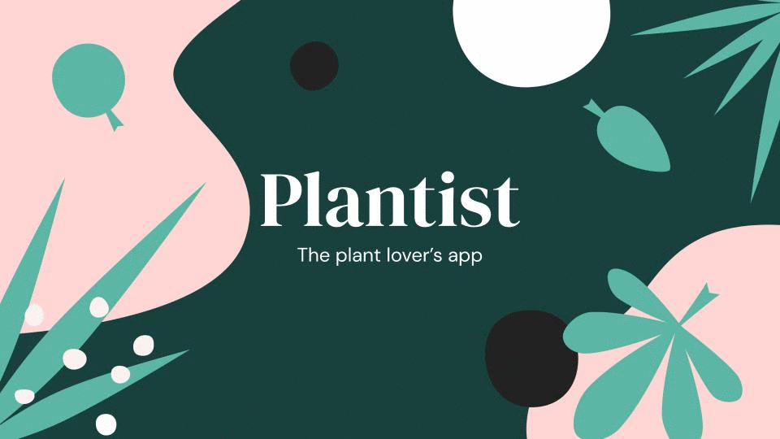
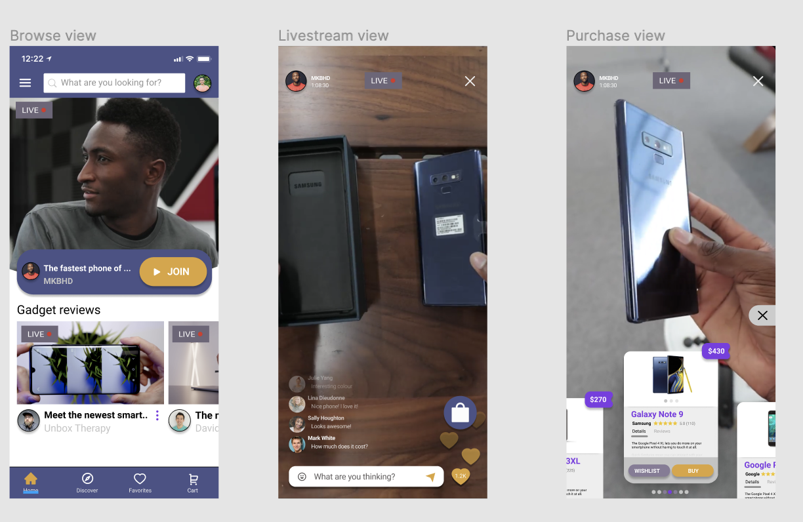
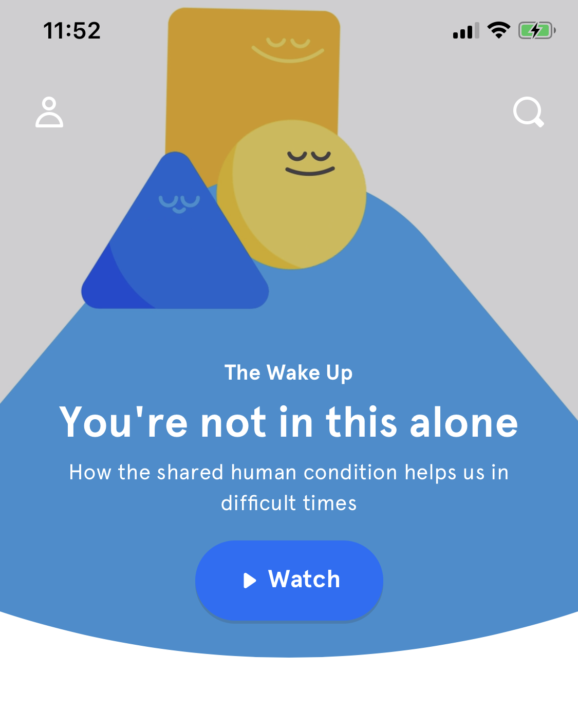
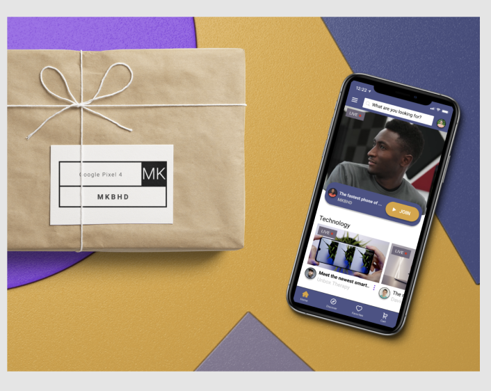

#### Index:

- [How I'm feeling so far](#howAmIfeeling)
- [The assignment for this week](#assignment)
- [My responses](#responses)
- [This week's assignment takeaways](#assignmentTakeaways)
- [This week's discussions takeaways](#discussionTakeaways)

###  How I'm feeling so far

As design school is wrapping up (1 more week to go), the workload is also increasing. This week we've had to hand in our group assignment, and our individual hi-fi designs of the shopping app.

My goal coming into the school was to learn how to use the design tools. I thought this was what's holding me back from creating designs the communicated my ideas.

I've started to realise this was a little short sighted, and I need to develop my creative design thinking and practice thinking like a designer.

I found myself browsing through dribble more often than I had expected to, because I struggled with visualising my ideas/concepts.

I think this is what people mean by _taking inspiration_ from dribble, I just wish there was a visual search engine to draw find the dribble that most resembles what you're looking for.

###  The assignment for this week

> This week we had to submit two assignments, a shopping app (individual) and a plant app (group).

####  Hi-fidelity design 

This week we’re going to take the fidelity to the next level, by converting each one of your three wireframes into a high-resolution product mock.

####  In-situ Designs

Use Artboard Studio to create an in-situ mock for one of your screens. Or another tool of your choice if you already have a favorite.

Your final image should be 800x600 (Dribbble HD size in Figma).

####  Redlines

After finishing your mocks, it’s time to prepare them for sharing with your engineering peers. We’ll be practicing using the tool Zeplin. Zeplin has a Figma integration you can use.

1. Import your 3 screens into Zeplin and your layers and groups are neatly ordered so that they can be easily read by your engineers.

2. Publish your zeplin file and post it along with your designs into Slack.

#### Wrapping up plant app

The final deliverable to our client was a presentation that had the mockups and assets of the products we were tasked to pitch. 

Based on our research of the target audience and the problem our client was trying to solve, we focused on showcasing what we believed are the 4 most important features:

1. Plant reminder
2. Plant advisor 
3. Search for plants
4. Place a plant

You can also view the Figma file [here](https://www.figma.com/file/z3anIBkjtEG3qvJs4KVPBj/Pretty-Good-Designers?node-id=264%3A8) if you're interested in seeing the wireframes. 

###  My responses

#### Hi-fidelity designs

**Browse view**

It took me time to realise that it's difficult to implement a loom-like video player for mobile. I found the video player was too small to support product thumbnails over the video timeline.

So I decided to take a slightly different approach where I still had one main featured video followed by a compact list of streams. 

I took inspiration from Headspace's homepage because I like how they present a new meditation every day.

I also wanted to experiment with _3D space_ a bit by using shadows between components. So I added a component on top of the featured video with a CTA to _join_ the live stream, and the relevant info about the stream.

**Livestream view**

This was a fun screen to do. It took me some time to find the right visual hierarchy of the video information in the nav bar. Since I chose to design for an iPhone X screen, I also needed to be aware of the front camera and its speaker that take up screen space at the top.

**Purchase view**

This was the most challenging screen to do. I changed the vertical product timeline that I had in the [lo-fi mockup](/week-10) to a more circular one structure. The initial intention was to show the viewer the showcased products without leaving the livestream view.

I struggled again with the visual hierarchy and organisation of the cards, so I moved the price out of the card and into a price tag at the top corner. One of my design colleagues designed their product view with muted tabs that had a line underneath (that I would presume move to the active tab). This was a design pattern that I was familiar with, but didn't consider. I felt the pattern would work well with the information that I wanted to portray, so I borrowed it for my product card as well.

#### In-situ designs

I'm a fan of Lewis Hilsenteger's Unbox Therapy, and I love how he starts every video with a packaged box before reviewing the product. Doesn't the user experience start from the moment you receive your product?

So I included a wrapped small box on the left (one of the not so many free assets) to give the viewer a sense of curiosity about what product/gadget is behind the wrapping.

This was made using [Artboard Studio](https://artboard.studio/) and their free wrapped box asset.

###  This week's assignment takeaways

Based on the feedback I got and noticing where I struggled most in this week's design assignment, I learnt that I should improve in:

- Using a grid system for my designs (I didn't use one, but it's next on my personal roadmap)
- Do more practice with visual and informational hierarchy
- Get familiar with design practices, to grow my design toolkit

Next week we will take this work further and make our hi-fi mockups interactive (design prototyping), which I'm super excited about. This final step will help me to finally see the comparison between designing an idea and building it out.

I'm interested in comparing the time/effort needed to visual a certain product X, and also how naturally it would have been for me to improve a design in the correct direction (prototyping is a powerful tool) vs building it and iterating on feedback to reach the same product.

###  This week's discussion takeaways

Our guest lecture this week was [Meg Lewis](https://twitter.com/yourbuddymeg), a designer who mixes comedy & performance.

Often when I listen to someone speak, I notice their personality and try to understand how it influences their style of communication and thinking process. In this moment I try to take inspiration of the mindset that they have created to personally grow and build empathy.

For the whole 30 min fire side chat, Meg Lewis was a balloon of positive energy, always smiling and laughing and also brutally honest about her story and vulnerabilities. We've had many amazing guests this week, and it's interesting to see how body language can capture the audience and this was one of them. A great YouTube channel that touches on this is [Charisma On Command](https://www.youtube.com/user/charismaoncommand) if you're interested in learning more.

Meg spoke about the story behind her podcast [Sit There & Do Nothing](https://sitthereanddonothing.com/) and her [personal branding style guide](https://www.fulltimeyou.co/). I learnt how she used her childhood (memories include comedians, silent comedians and circuses for example) to help craft the colours and personality of her style guide.

I also loved how she asked her self _'why can't meditation be funny?'_. It's a question that makes you think twice about what you believe meditation is.

Asking fundamental questions that challenge the status quo, I believe is very healthy habit to do. Needless to say, this anecdote channeled my energy, and I applaud Meg for having done this so well! 👏
