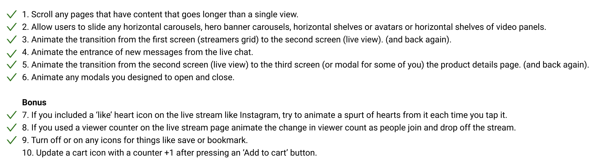

#### Index:

- [How I'm feeling so far](#howAmIfeeling)
- [The assignment for this week](#assignment)
- [My responses](#responses)
- [This week's assignment takeaways](#assignmentTakeaways)
- [This week's discussions takeaways](#discussionTakeaways)
- [What's next (new section)](#next)

###  How I'm feeling so far
It's the final week and I'm feeling a bit emotional about design school coming to an end. 

Over the past 12 weeks I've went from learning [empathy maps](/week-4) to using design systems to guide piecing together animations for a mobile app prototype that I designed. 

So having said that, I'm ecstatic to walk you through what I learnt and did this week!

###  The assignment for this week
> This week we were tasked with taking the high fidelity mockups of the live shopping app that we designed last week, to a functional (interactive) prototype.

Now, each person’s prototype is going to turn out differently, largely because you’ll be starting from different places. That said, there are some commonalities between everyone’s work that we can draw from for areas to animate. Here are some suggestions:
- Scroll any pages that have content that goes longer than a single view.
- Allow users to slide any horizontal carousels, hero banner carousels, horizontal shelves or avatars or horizontal shelves of video panels. (you may need to create some additional objects to pad out your carousels)
- Animate the transition from the first screen (streamers grid) to the second screen (live view). (and back again).
- Animate the entrance of new messages from the live chat.
- Animate the transition from the second screen (live view) to the third screen (or modal for some of you) the product details page. (and back again).
- Animate any modals you designed to open and close. 

Bonus for those looking for a challenge:
- If you included a ‘like’ heart icon on the live stream like Instagram, try to animate a spurt of hearts from it each time you tap it.
- If you used a viewer counter on the live stream page animate the change in viewer count as people join and drop off the stream.
- Turn off or on any icons for things like save or bookmark.
- Update a cart icon with a counter +1 after pressing an ‘Add to cart’ button.

###  My responses
Before I started prototyping, I wanted to improve my mockups from last week because I wasn't happy with how some of the flows/components felt. 

**So I got some feedback from Devin, my peers and my coach and saw some common themes:**
1. the heart animation doesn't look juicy/attractive enough to use
2. the colour system is a bit dull, doesn't motivate me to use the the interactive components
3. product card is too small and would be difficult to read on mobile
4. design pattern wrt to cancelling the product view screen is a bit odd (Floating Action Button on the right)

You can check out the Figma prototype [here](https://www.figma.com/proto/QjffU1w5lgBGZMyroEVKhr/Shopping-App?node-id=334%3A2&scaling=scale-down) if you'd like to interact with it. If the screen size doesn't look the same, make sure to select options > 'Fit - scale down to fit'.

This prototype checks off all of the main required and bonus interactions except for one - the 'add to cart' feature. I excluded this feature for two main reasons: 
1. I felt that having 3 CTA's (an 'add to cart', 'bookmark' and a 'buy' button) in the product description card would be too many interactive actions in a small area.
2. Since the products are under $50, and likely averaging around $20, the user would be comfortable with buying a product on the spot. If not, they'll more likely want to save the product for later than add it to cart.

###  This week's assignment takeaways

In [week 11's](/week-11) designs I displayed mobile phones that you could buy from the product carousel. I thought I could display the products that I related with the most to better design the experience, but Devin pointed out that the current design can't support my story. No one would buy an expensive product from a small carousel. 

This meant that I deviated too much from the design prompt and I should have thought more about what Noor would be willing to buy (prompt mentioned in [week 10](/week-10)).

While creating the component interactions, I picked up some technical skills like learning how to nest interactive layers, 'embedded videos' by piecing GIFs carefully and abstract elements to components so they could be used dynamically. There aren't as many Figma animation tutorials as I would have thought, so it took me a bit longer to find how to do some animations.

I also started looking into design style guides as a resource for some best practices on colour systems, UI transitions and UI layout patterns. I found [Material's design system](http://material.io/design/) and 
[Apple's Human Interface Guidelines](https://developer.apple.com/design/human-interface-guidelines/ios/overview/themes/) were the most helpful.

###  This week's discussion takeaways

This week we discussed the role of design prototyping and the value it can bring when used appropriately. 

> Why prototype a design? To *fake* an experience that answers a question. 

It's tricky to know if a user would pay for feature X, even if you asked them in a hypothetical manner. 

So I designed [Thank You Trees](https://thankyoutrees.io) as functional first and UX/UI design second application, because I wanted to answer the question of 'Do people want to plant trees collaboratively' as quickly as possible. There's no stronger signal than people spending their money for a solution you provide. 

A great video talking about why going functional first can be an appropriate choice is by [Michael Seibel](https://www.youtube.com/watch?v=1hHMwLxN6EM), CEO and Partner of Y Combinator. I think this works mostly for startups and customers who are forgiving of the experience as long as it solves a problem.

Having said that, it's important to recognize that there are different levels of prototyping and each one is suitable for specific purposes. Here's a rough idea of the simplest to most complex prototypes: 
1. Pen and paper, check out [Pen and Paper app](https://marvelapp.com/pop/)
2. Google Slides/Keynote/Powerpoint, you can create visual experiences using the animation tools
3. Mid-fi on a design tool (like my [week 10](/week-10))
4. Hi-fi on a design tool (like my [week 11](/week-11))
5. Functional design prototype on a design tool (like this week's entry)
6. A working prototype built on HTML/CS/JS (assuming it's a web app)

A visual example (like a hi-fi design) of an app can still convince a customer to believe that the features exist. This can emulate a real experience for the user, which you can enough of an environment (let's say you even fake the payment flow for example) to observe a real product interaction.

###  What's next
The goal of this design journal was to document my experiences as I started to take up design more seriously. I wrote this in such a way that if I had come across this on my own, without going through DOI, I'd be able to de-mystifying design and accomplish most of the things I did here. 

One big thing that this blog can't provide though, is the chance to ask and listen to designers talk about design for 18 (1.5 * 12) hours. This helped me get into the correct mindset, and approach design work differently. 

I'm still unsatisfied with my week 12 prototype and so I'm working on a second iteration based on the new feedback I received. 

I plan to write 1-2 more journal entries to show my final prototype and also share some of the reflections I made over the past 12 weeks. 

