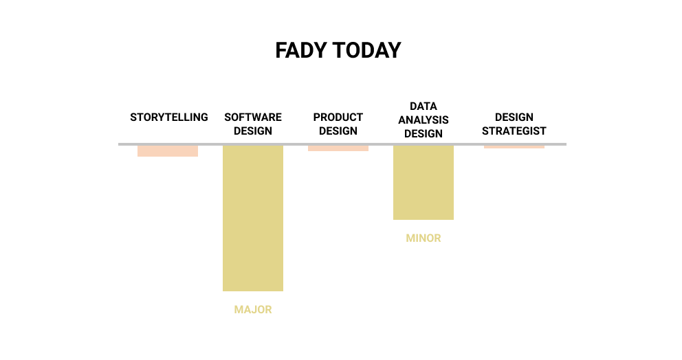
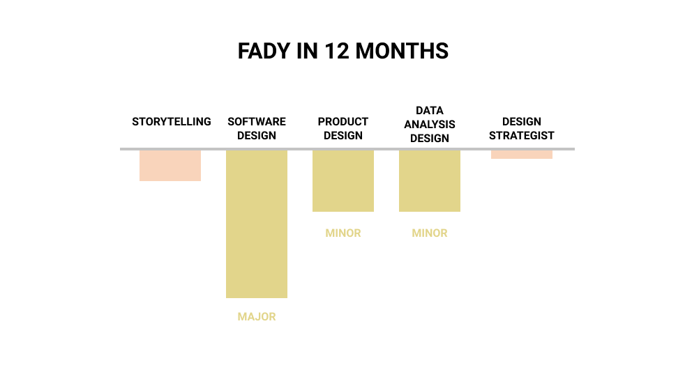
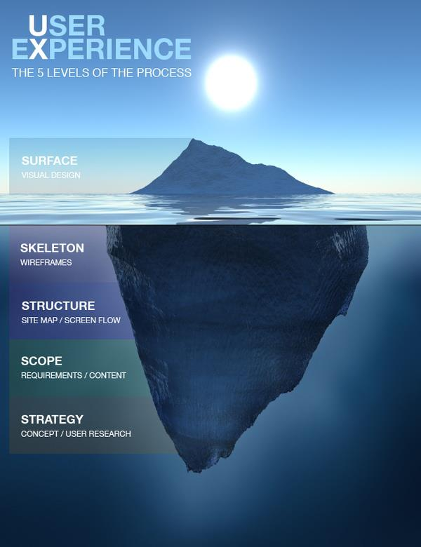

#### Index:

- [How I'm feeling so far](#howAmIfeeling)
- [The assignment for this week](#assignment)
- [My responses](#responses)
- [This week's assignment takeaways](#assignmentTakeaways)
- [This week's discussions takeaways](#discussionTakeaways)

###  How I'm feeling so far

This week was a bit rough. I am learning how to be present with my family, my significant other, my college work, design school and my passion project ([TYT](https://thankyoutrees)). All schools in Canada have just shut down, and there's a lot of panic with students as they figure out their current housing/school situations in addition to their summer plans (housing/jobs). It's difficult to focus when you've got to carefully manage a delicate situation at home.

On anther note, a friend out of the blue decided to send me 10 ThankYouTrees to show me her appreciation for being a good friend. I also built an gift scheduling feature for my professor from (last week's entry), so he (and anyone) could schedule gifts in advance. I feel humbled that people are investing their money into my passion project, and I'm slowly feeling the pressure of not dissapointing the people who've put their money and trust in me. 

###  The assignment for this week

This week we continue to explore different definitions of design and which design skills do we wish to develop over the next 12 months.

First, we were asked to write our own definition of design.

Second we were asked to create our own Pi Models (inspired by X from book Y). More on this in the [discussion takeaways](#discussionTakeaways) section to learn about this concept.

###  My responses

> **Write your personal answer to the question ‘what is design?’**

As a _software engineer_, design means creating software that is easy to maintain and grow as the business/users needs to develop.

As a _data scientist_, design is the art of crafting good experiments to help make correct data-driven decision.

And as an _optimistic future designer_, design right now means creating processes along with a story that users experience when interacting with anything human or nature made.

> **Create a skill pi model for now and in 12 months:**

My entrepreneurial mind considered doing this in the easiest way (on excel), however I wanted to take this opportunity to get familiar with a design tool before the heavy technical assignments in the coming weeks kick in.

Here's the link to my pi model on Figma ([link](https://www.figma.com/file/aPusehUDuFMZ27XmlJPgZV/Week-2---Design-Skill-Pi-Chart?node-id=0%3A1)).

Today I consider my core skills to be software/web engineering and data science. I've also highlighted other design skills that I plan to work on because I believe they complement my long term goals. I'll explain why:

- **Storytelling** is a skill everyone should learn in my opinion. If you want to talk about yourself, or even a project you're working on, storytelling is how you allow someone to build empathy (more on that next week). Empathy is important, because without it, everything would be treated like a black box and evaluated based on it's functionality.
- **Product Design** incorporates a bit of everything. Every company has their own definition of what product designer does. For my purposes I'm defining this as: 

>"The product designer is in charge of the entire process of creating products and usable experiences, starting with defining the problems of real people and thinking about their possible solutions.", [Carlos Beneyto](https://uxdesign.cc/the-job-of-the-product-designer-and-its-importance-in-a-startup-37f7235f5955).

This is important for me, because within the entire product cycle 
>**[research->design->prototype->launch->iterate/scale->iterate/scale(again)]**

I can contribute to the subsection of **[prototype->launch->iterate]**, and as an entrepreneur and an aspiring product manager, I have conducted customer **research/invterviews** to validate all feature ideas. 

This leaves me with a design gap. I don't know how to connect my research findings, to the appropriate design insights so that I could start prototyping an mvp. 

- **Design Strategist** 
> "Design strategist influence the direction of a product. Think more ambitious and more long term. Some agency, some vision, a lot of story story telling and communication to leadership.", [Devin Mancuso](https://dev.in)

As an entrepreneur I spend a lot of time pitching friends bad product ideas. I've learnt (with a bit of selection bias) how my community circle thinks. I also enjoy spending time creating _visions_ of ideas that I think are ground breaking. In order to communicate it one needs to storytell where society (or the consumer) is now and where it can go.

My logic behind the changes: 
- Since I don't do data science work regularly anymore, I recognize my skills will get outdated. However since I'm plugged in the community, read acamedic papers for fun and even discuss technical AI topics with research colleagues I will be at arms length. 
- My #1 growth focus is *product design*, connecting that chain of [research->DESIGN->prototype->launch->iterate/scale]. 
- My #2 growth focus is *story telling*. Since this is relevant in my personal life, as much as it is in professional career.
- My #3 growth focus is *design strategist*. This isn't a skill per se, as much as it's a job function I'd want to be close to/experience in some capacity.

Note: before this assignment I thought Figma and Framer were the same software (don't judge), but I figured it out on my own!

###  This week's assignment takeaways
My biggest assignment takeaway this week was learning how to view my story in a design lens and appreciating what *design* can mean. This was incredibly useful because up until recently I was only viewing design as a tool/a means to a goal.

Design in fact, is so much more than a fancy mockup since a valid mockup requires a lot of research before coming to a visual conclusion otherwise it can hurt the business more. 

This is a nice visual that was shared in class to illustrate my point.

###  This week's discussion takeaways

[Devin](https://dev.in/) explained that there are usually two buckets of designers: a) T-shaped designer and b) Pi-shaped designer.

T-shaped designers are those with one strong skill, while Pi-shaped designers are those with a major and 1-2 minor skills. You can read more about this [here](https://medium.com/@cminion/t-shaped-people-pi-shaped-people-and-cthulhu-shaped-people-b44888e0bac4). 

> “Design is the intentional solution to a problem within a set of constraints”, Mike Monteiro

Reflecting on this, I know I'm on a trajectory to be some sort of pi-shaped product manager. The sooner I figure out the personal story I want pursue, the sooner I can craft personal story and professional goals.