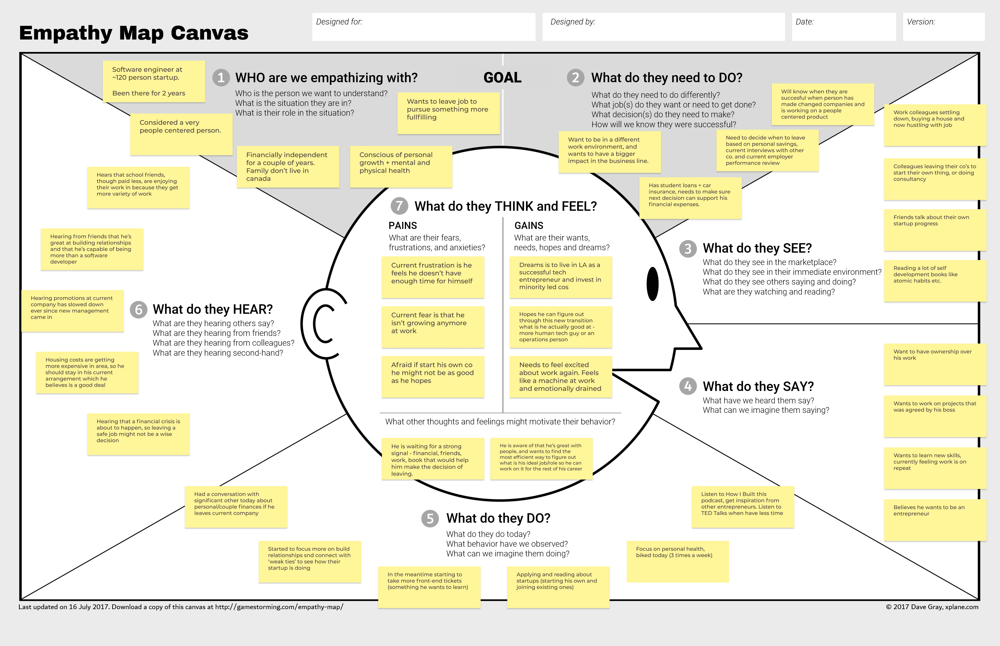
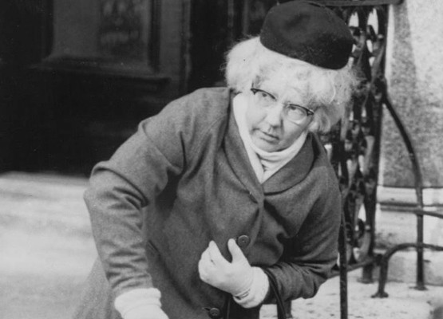

#### Index:

- [How I'm feeling so far](#howAmIfeeling)
- [The assignment for this week](#assignment)
- [My responses](#responses)
- [This week's assignment takeaways](#assignmentTakeaways)
- [This week's discussions takeaways](#discussionTakeaways)

###  How I'm feeling so far

I'm personally feeling a bit better now that it's WFH week 3. Doug Ford, Premier of Ontario, declared a state of emergency (for Ontario) so all non-essential services have to stop. 

On a more positive note I have been making progress with my personal health, as I squeeze more 20 mins runs this week (twitter [thread](https://twitter.com/fadifessa/status/1222936312237428737?s=20) progress).

###  The assignment for this week
This week we'll be practicing empathy maps to help us understand and relate to people. 

> **What is an empathy map?** It's a collaborative tool teams can use to gain a deeper insight into their customers.

> **What is it used for?** Empathy maps can be useful for the following purposes ([more info](https://www.solutionsiq.com/resource/blog-post/what-is-an-empathy-map/)):
>   - elaborating on user personas
>   - capturing behaviors when pair interviewing a customer
>   - building out the “user” in your user story

1. Identify a colleague who finds it hard to understand the value of design and create an Empathy Maps for them using the templates located in Bonus Materials this week. Typical examples could include a PM, Eng. Lead, VP Legal, etc.
    - Draw from current or previous experiences, but to prevent shaming, avoid real names.
    - Include a little background on the org and the individual — think basic characteristics (role or responsibilities), so peers understand the context
    - If you haven’t got enough real-world experience to draw from then you’ll replace this colleague map with another student map (see below).
2. Interview one of your fellow classmates and create an empathy map for them.
    - You’ll need to think about what questions you’re going to ask in order to get the necessary information to complete the map. 
3. Draw conclusions from your work with these reflection statements. Look for actionable insights that you can bring back into your day-to-day work or studies.

###  My responses

My assignment response is [here](https://www.figma.com/file/P9ndOXPQ3kIFdvy1daZKds/Week-3?node-id=41%3A2), however I also included my latest map below for your convenience.

 

Note: You can see in the _Before review_ and _After review_ figma pages, how my empathy map changed once I got my assignment feedback and redid my empathy map.

###  This week's assignment takeaways
I found it difficult to interview people for an empathy map in the beginning. Despite understanding the sections of the map, I couldn't put together a conversation in my head, to organically discover the thoughts/needs/wants of my interviewee. I also got a bit confused on how to approach sections 1 and 2 (Goal).

In web development, folks sometimes screenshare as they start a project from scratch. This helps beginners learn by watching, and also have an idea of what a good example looks like. Unfortunately, I couldn't find an example of an empathy map conversation online so I learnt by doing. 

In the second part of the assignment, I had to interview a fellow classmate. This was very helpful, because my classmate offered some tips and personal examples, as I was conducting my interview. 

The advice I would give myself in the beginning: 
- Focus on a problem/challenge/topic you'd like to have the conversation about. 
- Make sure to set the scene of the interview with sections 1 and 2 of the map before moving on to different sections. Sections 1 and 2, along with the topic you're focusing on (previous point) will help keep the conversation be constructive.
- Keep it simple, but ask why if you're not satisfied with understanding. 
- Keep thinking how your observations connect the interviewee with the topic and goals (section 1 and 2).
-  Read the map clockwise, its like a story. For the most part, it does work.

I also found a couple of good resources on [uxpin](https://www.uxpin.com/studio/blog/the-practical-guide-to-empathy-maps-creating-a-10-minute-persona/), [uxbooth](https://www.uxbooth.com/articles/empathy-mapping-a-guide-to-getting-inside-a-users-head/) and [youtube](https://www.youtube.com/watch?v=kAdbbsZolOw) that helped me get an idea of how the tool works.

###  This week's discussion takeaways
At accelerators and also in school, we're taught how to use a business model canvas. As the name suggests this is a tool to develop or document business models into: 
- Key partners
- Key activities 
- Key resources
- Value proposition
- Customer relationships 
- Customer segments
- Channels
- Revenue streams 
- Cost structure

I can see why it makes sense (since assumptions), to *blackbox* the customer into discrete sections: 
 1) segments, 
 2) relationships and, 
 3) indirectly, the value proposition (which solves customer problems).

> The Empathy Map was created with a pretty specific set of ideas and is designed as a framework to complement an exercise in developing empathy - Dave Gray, founder of XPLANE

Since I'm past the business planing stage, I'm a lot more engaged with users for Thank You Trees. As a result I think of the business model canvas as a nautical compass to help set the direction of the ship, while the empathy map fine tunes it.

#### Patricia Moore
We also learnt about Patty Moore, my new role model. A great article I found that talks about her story is by [Roman Krznaric](https://www.romankrznaric.com/outrospection/2009/11/01/117), which I'll be shortening below.

Patricia Moore, an industrial designer, was frustrated that her prestigious design firm employer, Raymond Loewy, didn't want to design for people with arthritis. So she decided to conduct an empathy experiment and dress up as an 80 year old woman for 3 years. 

She tried shopping in supermarkets, going up and down stairs, in and out of department stores, catching the bus, opening fridge doors, using can openers and much more. At one point she was robbed, beaten and left for dead by a gang of youths.

Based on her experiences and insights, she was able to design a whole series of innovative products that were suitable for use by elderly people.

She is credited as one of the founders of Universal Design, an approach in which products are designed non-exclusively, for use by the widest range of consumers possible, and which has now become standard in the industry.