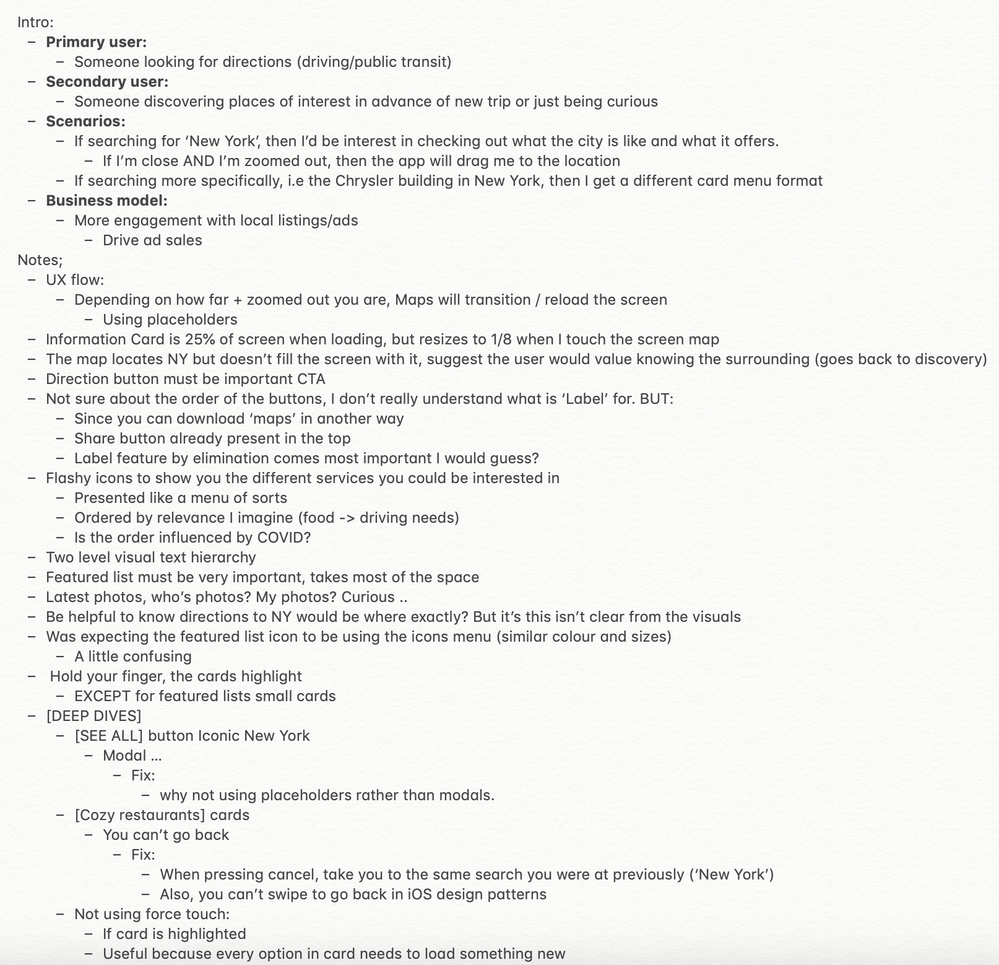
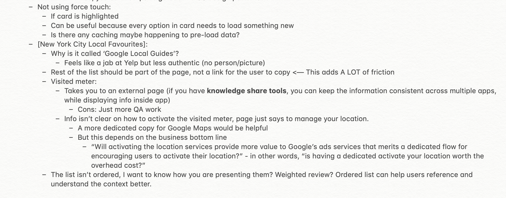

#### Index:

- [How I'm feeling so far](#howAmIfeeling)
- [The assignment for this week](#assignment)
- [My responses](#responses)
- [This week's assignment takeaways](#assignmentTakeaways)
- [This week's discussions takeaways](#discussionTakeaways)

###  How I'm feeling so far
This week I found out that my internship is being pushed back by a month but everything else is staying the same. I'm feeling very grateful about still having an summer job because a lot of students that I know gotten their offer rescinded.

I was also pretty excited about this week's assignment as I was familiar with it to an extent because it's a common question in Product Management interviews - critiquing an app.

###  The assignment for this week
1. For this assignment you will be doing an app critique of ‘Google Maps’ (on either iOS or Android).
- Your pseudo interviewer would like you to ***“Search for ‘New York’”*** and then begin your critique once you’ve hit search.
- Record the app critique and post your video to #201-assignments.
- Keep these short, sharp and sweet, no more than ~10 minutes.
- Read up the Critique Tips below

###  My responses
I found it a bit difficult to constructively critique Google Maps, perhaps because I also haven't used it for a long time since moving in with my parents. Google Maps is a polished application and I've never practiced with anyone before so I was also a bit nervous to share my thoughts. 

I also knew I had to think more about design than I would normally do in a product scenario, so I decided to make some notes about the Google Maps experience which you can get a glimpse of below. 

I uploaded my assignment response video to youtube in case you're interested.

`youtube: https://www.youtube.com/watch?v=XXFmUw19m9s`

###  This week's assignment takeaways
Looking back at the feedback I got and comparing what I analysed vs what my peers analysed, it looked like I went more broad than deep in my analysis. This meant that I didn't get as design technical as I had intended to. 

I consolidated the feedback I received into two sections below: 1) what went well 2) what could have improved.

**What went well:**
1. Good use of placeholders / force touch and its impact on user experience
2. Good mention of the loading inconsistencies, the vague nature of local referrals, the unclickable link in the bio
3. Great eye for linking your analysis back to relevant news (covid)
4. Highlighting the order of the icons
5. Good mention about the UX being confusing where in New York the app was directing you when you search "New York"

**What could be improved:**
1. Hard to follow how I navigate to new pages. I should call out what elements I'm selecting.
2. Keep using good transitions like “To continue down the page…” and continue pausing between different comments.
3. Go a little deeper on typography since I touched on it's visual hierarchy. 
4. Call out the task being issued and riff a little of what the user goals of such a task could be in the beginning. Am I looking up NYC because you're going there soon or just looking up cities from across the globe?
5. If I were looking to dig deeper I could have commented on accessibility of the features.
6. There’s an opportunity to expand more on the "local favorite" section and add more detail. How would I fix it so users could have a better idea of who curated it and maybe articulate more how social proofing could play a role.
7. Speak to the potential tradeoffs of why certain design decisions were made. 

###  This week's discussion takeaways
This week we touched on some of the good practices and thinking process we should be doing when app critiquing. I found this time incredibly useful because it gave me an idea of what designers normally think about during app critics. 

Most of these prompts are applicable to product interviews as well, I guess the answer is slightly different based on the interview (design/product): 
- How do they use typeface:
    - How does that create hierarchy 
    - Leading high rise? 
- Cute illustration used? This could be to soften the experience when the user has lost a playlist for example … 
- If you’re a technical, you can talk about the interaction with the OS level 
- What is the mission state of the company
- What is the business model 
- Who are the primary audience 
- Are there any solutions on the market 
- Usage of design principles - grouping things together:
    - Ergonomics, minimise movement of thumb 
    - How are gestures leveraged?
        - Tap, swipe double tab, force touch
        - Shake, squeeze, 
