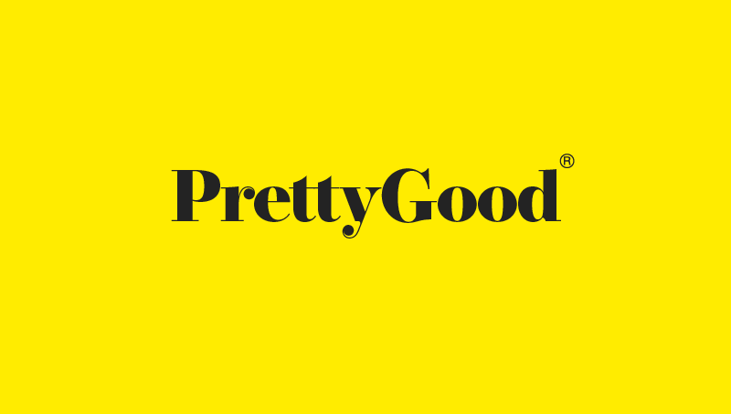

#### Index:

- [How I'm feeling so far](#howAmIfeeling)
- [The assignment for this week](#assignment)
- [This week's discussions takeaways](#discussionTakeaways)

###  How I'm feeling so far

I'm feeling great this week. I was able to do some exercise at home (swallowed a fly while exercising in the backyard), did a [small launch of TYT](https://www.linkedin.com/feed/update/urn:li:activity:6658729994803650560/) on Linkedin and [got interviewed](https://www.youtube.com/watch?v=GqDkV6JhbUg) about TYT as well.

I've also been spending time this week reconnecting with friends. I'm horrible with maintaining a text conversation over a few days so I'm coordinating time to catch up over Hangouts.

###  The assignment for this week

This week we don't have an assignment to hand in. However we were assigned a group to work on a group project in parallel to the individual assignments.

For this group project, I was paired with [Paul Brophy](https://paulbrophy.co.uk/), and Lucy Liu. Paul's a brilliant full stack developer turned designer based in the UK, and Lucy's an equally amazing designer doing her undergrad in IT in Australia.

We were tasked with creating our own design agency (which we called **_Pretty Good_**), work with a hypothetical client (cough Devin), and design a product for the Dept. of Illusions.

Side note: I enjoy working in groups, so I'm very much looking forward to getting to know my team, and learn their own processes of design. I learn a lot from seeing people solve the problems their own way because I can then find my own process that works with me.

#### Group Assignment

We were tasked with designing a plant app for an Illusions Inc's client ([Refinery 29](http://refinery29.com/)). By week 11 we are expected to produce a product deck along with all the design assets relevant for this project.

So after a brief email exchange and some market/problem research, we had a client call with Devin to get his thoughts on our ideas and direction for the plant app. Our client gave us an idea of what they want, but nothing specific despite preparing specific questions to validate our directions. I guess this is how a lot of agency/freelance work must be like (probably a lot more difficult too).

###  This week's discussion takeaways

Often I find myself learning about non-design things in the lecture, and this week was one of them.

Devin found writing an email to himself on Friday evenings, helped him resume work easier on Monday. It should take you max 30 mins on Friday, but it can save you more than that on Monday.

I also learnt that it's okay to build a story around your proto-personas during a white board interview. I remember during last week's mock interview, I had listed a couple of points for Alex and Jenny (my proto-persona couple) but it felt very Frankenstein-like to keep on adding points to a list that represented a story. So nevertheless it made the interview a bit less empathetic than I had hoped for.
