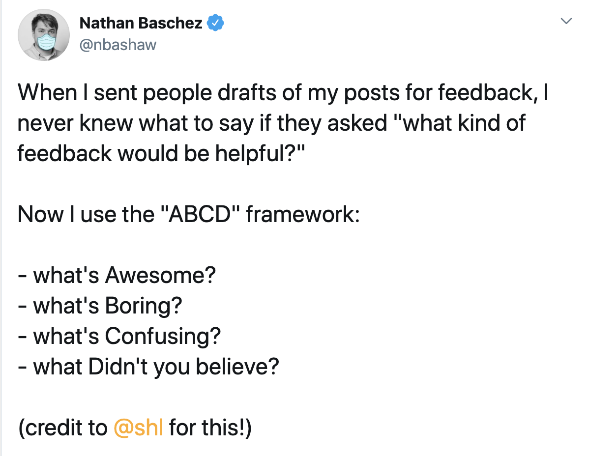

#### Index:

- [How I'm feeling so far](#howAmIfeeling)
- [The assignment for this week](#assignment)
- [Our responses](#responses)
- [This week's assignment takeaways](#assignmentTakeaways)
- [This week's discussions takeaways](#discussionTakeaways)

###  How I'm feeling so far
I'm still feeling good this week. At the beginning of our lecture we started to do a ***peaches and pits*** style standup, where everyone says something good and not so good about their week. I'm sure I do have pits, but this is the second time (out of 3) that no pit comes to my mind to share. I do forget a lot of hardships quickly, and I've started to embraced this mostly as a blessing in disguise.

It's also Mother's day today (happy Mother's day!). I shared some helpful content on how to make your mom feel appreciated on FB. It was a value add piece, but I also plugged in Thank You Trees as an optional tool people can use to personalise their thoughtful gifts.

I'm super happy to share that TYT today has crossed the $1,000 sales mark. I feel very humbled to have helped people plant 1,000 trees as part of their gifts for other people. I've so far observed some ***very interesting*** user behaviours, and I'll dig deep into uncovering their motivations.

###  The assignment for this week
This week we don't have an individual assignment this week so we can continue working on the group project for our client, Illusions Inc. 

###  Our responses
We shared with Devin a low-fi mockup of the features that we ended up pursuing (4 in total). I told my team, that I'd like to work on the **reminder feature** because I already had an idea of how the customer base would be using it. 

I procrastinated a lot for this assignment. I think this is because I felt a bit nervous as this my first time using Figma and also my first time getting design feedback on any visual design work.

The customer journey I had in mind for the above design, was to: 
1. show the user a list of their current reminder commitments
2. if they select the 'add/plus icon', they'll be asked:
    1. **who** the reminder is for,
    2. the appropriate reason (**why**) for the reminder,
    3. and the appropriate time (**when**) for the reminder

###  This week's assignment takeaways
Some highlight of the feedback I received from my coach include: 
1. The information priority of what I'm highlighting as most important
2. The second screen wasn't clear. What does *General* mean etc. 

###  This week's discussion takeaways
This week's lecture is on Design Research. 

This was my first time learning about Design Research in a technical fashion. I learnt about the various types of design research in the Qualitative- Quantitative vs Behavioral-Attitudinal  matrix. 

I'm embarrassed to admit that I thought feedback was a linear one-dimensional process. I thought it was about ask potential customers their pain points, or ask questions that can help you hypothesis their pain points. Then iterate until you have arrived to a common denominator amongst your audience. 

[This resource](https://www.nngroup.com/articles/which-ux-research-methods/) by the NN Group is one of the suggested readings we had for this week. The article does a good job in describing the landscape of design research, which I think is important to be familiar with because it gives you context when pursuing feedback.  

At Thank You Trees, I typically conducted customer interviews with a simple framework ([ABCD](https://twitter.com/nbashaw/status/1237131727635501056?lang=en)) to keep informal conversations constructive and passive. At least in early stage products/startups, I want to be a relationship with my users so that they feel more comfortable with the product and also communicate their thoughts more freely.
